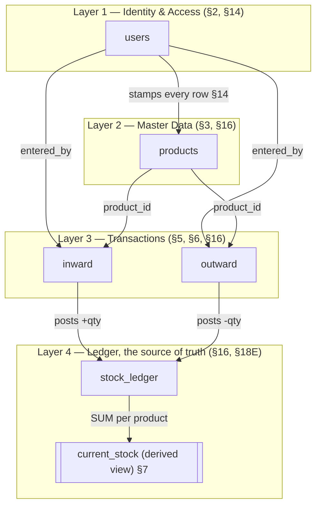
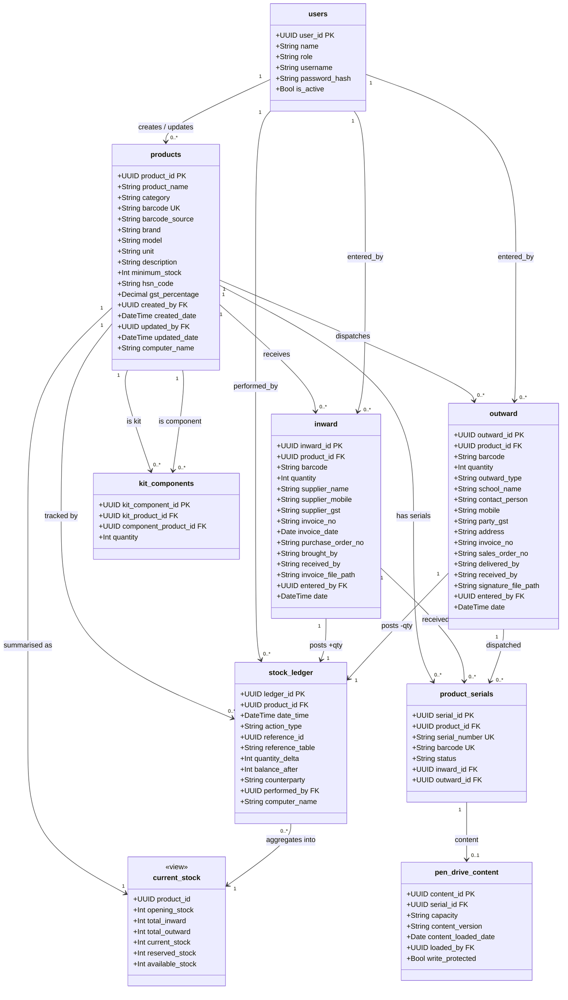
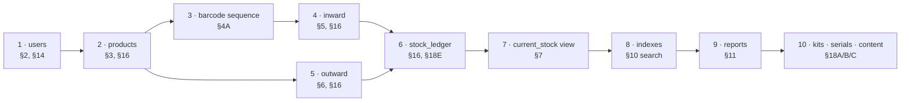
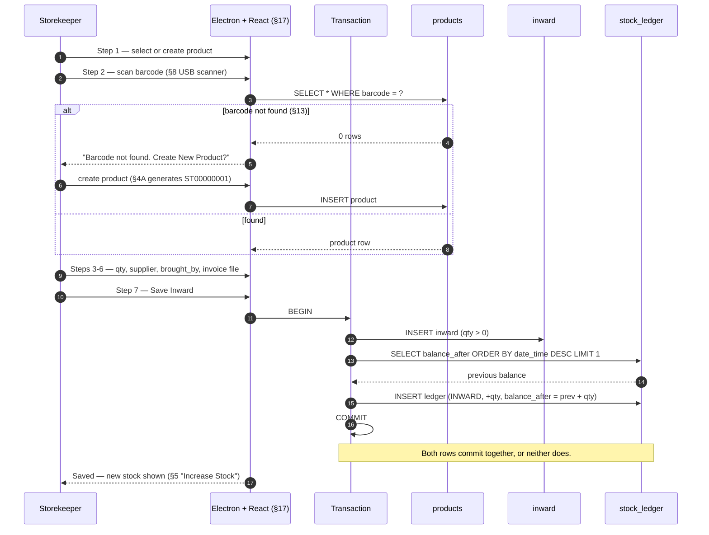
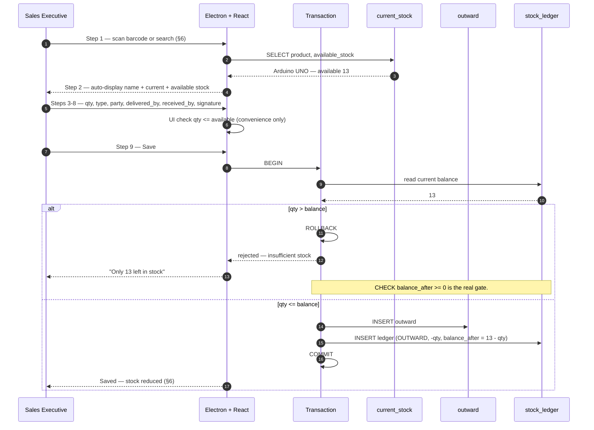
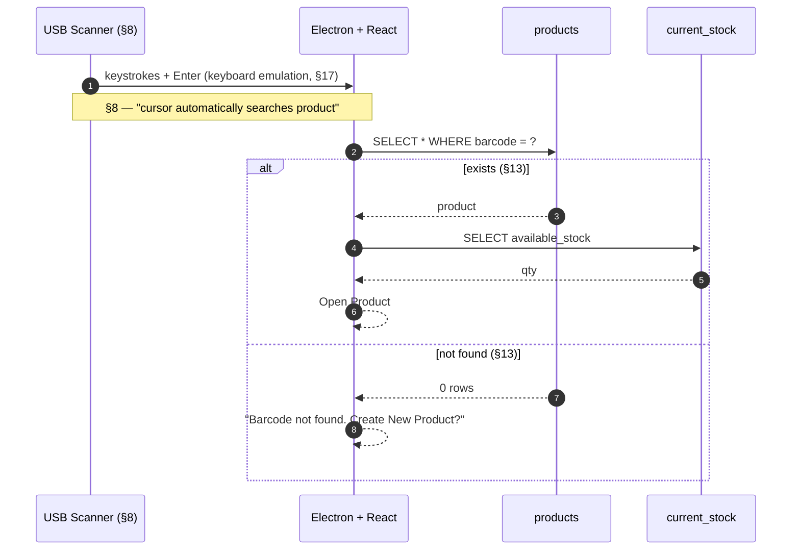
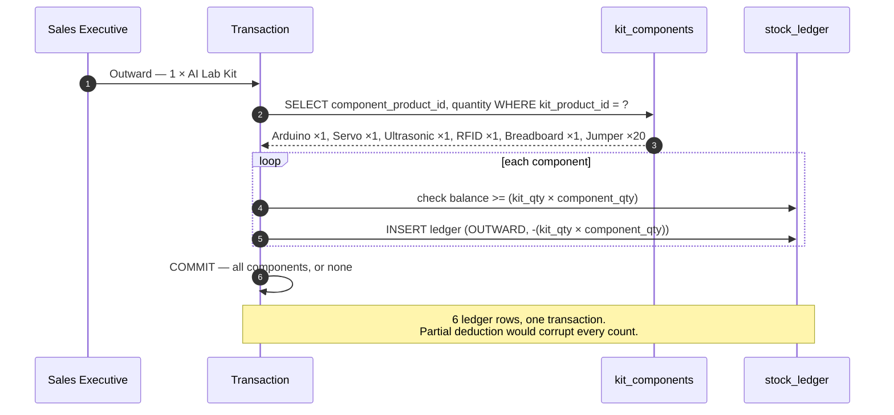

# Database Architecture & Management

**Source:** Software Requirement Document (SRD) v1.0 — Siddesh Technologies Pvt. Ltd.
**Scope rule for this document:** every table, column, and rule below is traceable to an SRD
section, cited as **§n**. Where the SRD is silent or self-contradictory, that is called out
explicitly in [§13 Gaps](#13-gaps-in-the-srd--decisions-it-does-not-make) rather than filled
in silently — those are decisions for the team, not assumptions to bury in a schema.

---

## 1. Top-down: from objective to tables

### 1.1 The objective (SRD §1)

> Maintain complete records of all inventory movement, eliminate manual register entries,
> and maintain **complete traceability of every product**.

"Complete traceability" is the single requirement that decides the whole architecture.
It is why the design is **ledger-first**: stock is not a number you edit, it is a number you
*derive* from an immutable history. §16 states the rule outright — *"Every stock movement.
Never delete. Only append."*

### 1.2 Modules (§1) → data they need

| SRD module | § | Needs |
|---|---|---|
| Product Master | §3 | `products` |
| Barcode Generation | §4 Option A | `products.barcode` + a number sequence |
| Barcode Scanning | §4 Option B, §8, §13 | `products.barcode` lookup |
| Inward Entry | §5 | `inward` → `stock_ledger` |
| Outward Entry | §6 | `outward` → `stock_ledger` |
| Current Stock | §7 | derived view over `stock_ledger` |
| Inventory History | §11, §18E | `stock_ledger` |
| Reports | §11 | queries over all of the above |

### 1.3 The four layers



**Rule of the architecture:** Layer 3 never writes stock. It records *paperwork*
(who, which invoice, which school). Layer 4 records *movement*. One inward = one `inward`
row **and** one `stock_ledger` row, written together or not at all. Current stock is never
stored as an editable field — it is the running total in Layer 4.

---

## 2. Entity inventory — SRD traceability

Every table, and the section that mandates it. Nothing here is invented.

| # | Table | Mandated by | Status |
|---|---|---|---|
| 1 | `users` | §2 (roles), §14 (Created By / Updated By) | Core |
| 2 | `products` | §3 (fields), §16 (Product Master) | Core |
| 3 | `inward` | §5 (workflow), §16 (Inward) | Core |
| 4 | `outward` | §6 (workflow), §16 (Outward) | Core |
| 5 | `stock_ledger` | §16 (Stock Ledger), §18E (timeline) | Core — the source of truth |
| 6 | `current_stock` *(view)* | §7 (dashboard), §12 (cards) | Derived, not a table |
| 7 | `kit_components` | §18A (Bill of Materials) | Recommended by SRD |
| 8 | `product_serials` | §18B, §15 (Serial Number Tracking) | Recommended by SRD |
| 9 | `pen_drive_content` | §18C | Recommended by SRD |
| 10 | `schools` / `vendors` | §15, §18D | Future |
| 11 | `purchase_orders` / `sales_orders` | §15 | Future |

> §16 lists only four tables. `users` comes from §2 + §14, and `current_stock` from §7 —
> both are required by the SRD's own text even though its table list omits them.

---

## 3. Class diagram — every table and relationship



---

## 4. Relationship matrix

Every relationship, its cardinality, and — the part usually left undecided — what happens
on delete.

| # | Parent | Child | FK | Card. | On delete | Why |
|---|---|---|---|---|---|---|
| 1 | `users` | `products` | `created_by`, `updated_by` | 1 : 0..* | **RESTRICT** | §14 audit is worthless if the user vanishes. |
| 2 | `users` | `inward` | `entered_by` | 1 : 0..* | **RESTRICT** | §16 "Entered By". |
| 3 | `users` | `outward` | `entered_by` | 1 : 0..* | **RESTRICT** | §11 Sales-Executive-wise report reads this. |
| 4 | `users` | `stock_ledger` | `performed_by` | 1 : 0..* | **RESTRICT** | §18E "user who performed the action". |
| 5 | `products` | `inward` | `product_id` | 1 : 0..* | **RESTRICT** | Deleting a product would orphan its history. |
| 6 | `products` | `outward` | `product_id` | 1 : 0..* | **RESTRICT** | Same. |
| 7 | `products` | `stock_ledger` | `product_id` | 1 : 0..* | **RESTRICT** | §16 "Never delete." |
| 8 | `inward` | `stock_ledger` | `reference_id` | 1 : 1 | **RESTRICT** | The ledger row *is* the audit proof. |
| 9 | `outward` | `stock_ledger` | `reference_id` | 1 : 1 | **RESTRICT** | Same. |
| 10 | `products` | `kit_components` | `kit_product_id` | 1 : 0..* | CASCADE | §18A — deleting the kit deletes its recipe, not its components. |
| 11 | `products` | `kit_components` | `component_product_id` | 1 : 0..* | RESTRICT | A component in use cannot be deleted. |
| 12 | `products` | `product_serials` | `product_id` | 1 : 0..* | RESTRICT | §18B |
| 13 | `product_serials` | `pen_drive_content` | `serial_id` | 1 : 0..1 | CASCADE | §18C — content belongs to the physical drive. |

**Nothing in this schema is ever hard-deleted.** Every FK above is RESTRICT or CASCADE onto
a child that is itself meaningless alone. This is §16's *"Never delete. Only append."*
enforced structurally rather than by convention. Retire a product with an `is_active` flag.

### Why relationships 8 and 9 are 1:1, not 1:many

One inward = exactly one ledger row. If an inward could post two ledger rows, stock would
double-count; if it could post zero, stock would silently drift from the paperwork. Enforce
with a UNIQUE constraint on `(reference_table, reference_id)`.

---

## 5. Table definitions

### 5.1 `users` — §2, §14

| Column | Type | Constraints | SRD |
|---|---|---|---|
| `user_id` | UUID | **PK** | §14 |
| `name` | TEXT | NOT NULL | §14 |
| `username` | TEXT | **UNIQUE**, NOT NULL | §17 auth |
| `password_hash` | TEXT | NOT NULL | §17 |
| `role` | TEXT | NOT NULL, CHECK in (`ADMIN`,`STORE_MANAGER`,`SALES_EXECUTIVE`) | §2 |
| `is_active` | BOOLEAN | DEFAULT true | — |

> §2: *"Initially only one Admin login. Later support Admin / Store Manager / Sales
> Executive."* The **column exists from day one** with all three values allowed; only the
> UI gate is deferred. Adding a role column later means backfilling every audit row.

### 5.2 `products` — §3, §16

| Column | Type | Constraints | SRD |
|---|---|---|---|
| `product_id` | UUID | **PK** | §16 |
| `product_name` | TEXT | NOT NULL | §3, §16 |
| `category` | TEXT | NOT NULL | §3, §16 |
| `barcode` | TEXT | **UNIQUE**, NOT NULL | §4, §16 |
| `barcode_source` | TEXT | CHECK in (`GENERATED`,`MANUFACTURER`) | §4 A/B |
| `brand` | TEXT | | §3, §16 |
| `model` | TEXT | | §3 "Model Number", §16 |
| `unit` | TEXT | NOT NULL | §3, §16 |
| `description` | TEXT | | §3, §16 |
| `minimum_stock` | INTEGER | NOT NULL DEFAULT 0 | §3 "Minimum Stock Alert", §16 |
| `hsn_code` | TEXT | NULL | §3 (optional) |
| `gst_percentage` | NUMERIC(5,2) | NULL | §3 (optional) |
| `is_active` | BOOLEAN | DEFAULT true | soft delete |
| `created_by` | UUID | FK → users | §14 |
| `created_date` | TIMESTAMP | NOT NULL | §14 |
| `updated_by` | UUID | FK → users | §14 |
| `updated_date` | TIMESTAMP | | §14 |
| `computer_name` | TEXT | NULL | §14 (optional) |

**`barcode_source` is not in the SRD's field list**, but §4 requires both Option A
(generated) and Option B (manufacturer-pasted) to be supported. Without this column you
cannot tell which labels you may reprint — reprinting a manufacturer barcode from your own
software produces a label that is wrong the moment the manufacturer changes it.

**Barcode format (§4, §9):** `ST` + 8 digits — `ST00000001`, `ST00012345`. Generated from a
number sequence, zero-padded. Only for `barcode_source = 'GENERATED'`.

**Categories (§3):** examples are *AI Lab*, *Digital Products*, *Office Items*. §16 models
this as a plain field on Product Master, so that is what is specified above. See §13.3 for
why a lookup table is the better call.

### 5.3 `inward` — §5, §16

| Column | Type | Constraints | SRD |
|---|---|---|---|
| `inward_id` | UUID | **PK** | §16 |
| `product_id` | UUID | FK → products, NOT NULL | §16 |
| `barcode` | TEXT | NOT NULL | §16 — snapshot, see note |
| `quantity` | INTEGER | NOT NULL, **CHECK > 0** | §5 Step 3, §16 |
| `supplier_name` | TEXT | NOT NULL | §5 Step 4, §16 |
| `supplier_mobile` | TEXT | | §5 Step 4 |
| `supplier_gst` | TEXT | NULL | §5 Step 4 (optional) |
| `invoice_no` | TEXT | | §5 Step 4, §16 |
| `invoice_date` | DATE | | §5 Step 4, §16 |
| `purchase_order_no` | TEXT | | §5 Step 4, §16 |
| `brought_by` | TEXT | | §5 Step 5 |
| `received_by` | TEXT | | §16 |
| `invoice_file_path` | TEXT | NULL | §5 Step 6 (optional PDF/Image) |
| `entered_by` | UUID | FK → users, NOT NULL | §16 |
| `date` | TIMESTAMP | NOT NULL | §16 |

**`brought_by` vs `received_by`** — these are two different people and §5 keeps them apart.
Step 5 is *"Person Who Brought Material"* (examples: Atharva Birari, Courier, Blue Dart,
DTDC, Supplier Representative) — that is `brought_by`. §16's *"Received By"* is your
storekeeper who took delivery. Collapsing them loses the courier trail.

**`CHECK quantity > 0`** — inward is always positive. Direction lives in `action_type`, never
in the sign of a form field.

**Why `barcode` is duplicated here** — it is a **snapshot of the label as scanned**, not a
lookup key. If a product's barcode is ever corrected, historical inwards must still show the
label that was physically on the box that day. Read the product via `product_id`; keep
`barcode` for the audit trail.

### 5.4 `outward` — §6, §16

| Column | Type | Constraints | SRD |
|---|---|---|---|
| `outward_id` | UUID | **PK** | §16 |
| `product_id` | UUID | FK → products, NOT NULL | §16 |
| `barcode` | TEXT | NOT NULL | §16 — snapshot |
| `quantity` | INTEGER | NOT NULL, **CHECK > 0** | §6 Step 3, §16 |
| `outward_type` | TEXT | NOT NULL, CHECK in 6 values | §6 Step 4, §16 |
| `school_name` | TEXT | NOT NULL | §6 Step 5 "School Name", §16 "Party" |
| `contact_person` | TEXT | | §6 Step 5 |
| `mobile` | TEXT | | §6 Step 5 |
| `party_gst` | TEXT | NULL | §6 Step 5 (optional) |
| `address` | TEXT | | §6 Step 5 |
| `invoice_no` | TEXT | | §6 Step 5, §16 |
| `sales_order_no` | TEXT | | §6 Step 5 |
| `delivered_by` | TEXT | | §6 Step 6 "Person Handing Over", §16 |
| `received_by` | TEXT | | §6 Step 7 "Receiver Name", §16 |
| `signature_file_path` | TEXT | NULL | §6 Step 8 (optional) |
| `entered_by` | UUID | FK → users, NOT NULL | §14 |
| `date` | TIMESTAMP | NOT NULL | §16 |

**`outward_type`** (§6 Step 4) — exactly six values, no others:
`SALE` · `DEMO` · `REPLACEMENT` · `INTERNAL_USE` · `SERVICE` · `SAMPLE`

**§11 "Sales Executive-wise" report** is satisfied by `entered_by` → `users.role =
'SALES_EXECUTIVE'`. No separate column needed.

### 5.5 `stock_ledger` — §16, §18E — **the source of truth**

§16 gives this table three words of specification: *"Every stock movement. Never delete.
Only append."* Its columns come from §18E's timeline requirement.

| Column | Type | Constraints | SRD |
|---|---|---|---|
| `ledger_id` | UUID | **PK** | — |
| `product_id` | UUID | FK → products, NOT NULL | §18E |
| `date_time` | TIMESTAMP | NOT NULL | §18E "Date and time" |
| `action_type` | TEXT | NOT NULL, CHECK in (`OPENING`,`INWARD`,`OUTWARD`) | §18E "Inward/Outward action" |
| `reference_table` | TEXT | CHECK in (`inward`,`outward`) | link to paperwork |
| `reference_id` | UUID | | → `inward_id` / `outward_id` |
| `quantity_delta` | INTEGER | NOT NULL, **CHECK <> 0** | §18E "Quantity" (+20 / −5, §11) |
| `balance_after` | INTEGER | NOT NULL, **CHECK >= 0** | §18E "Balance stock after the transaction" |
| `counterparty` | TEXT | | §18E "Supplier or customer" |
| `performed_by` | UUID | FK → users, NOT NULL | §18E "User who performed" |
| `computer_name` | TEXT | NULL | §14 (optional) |

Constraints that carry the design:

```sql
UNIQUE (reference_table, reference_id)   -- one transaction = one ledger row (§4 rel. 8/9)
CHECK  (quantity_delta <> 0)             -- a movement of zero is not a movement
CHECK  (balance_after >= 0)              -- stock cannot go negative
CHECK  (action_type = 'INWARD'  AND quantity_delta > 0
     OR action_type = 'OUTWARD' AND quantity_delta < 0
     OR action_type = 'OPENING' AND quantity_delta > 0)
```

**This table takes no UPDATE and no DELETE, ever.** Not by policy — revoke the privileges.
A mistake is corrected by *appending a reversing entry*, never by editing history. §16 is
one sentence, but it is the sentence the entire audit story rests on: if a row can be
edited, no report from this database can be trusted in a dispute.

`balance_after` is denormalized on purpose. §11's Product Ledger and §18E's timeline both
require showing the balance *as it stood at that moment*. Recomputing it by summing every
prior row makes the ledger slower with every passing month; storing it makes §11 a single
indexed read.

### 5.6 `current_stock` — §7 — a **view**, not a table

§7 requires: Product · Opening Stock · Inward · Outward · Current Stock · Reserved Stock
(future) · Available Stock.

```sql
CREATE VIEW current_stock AS
SELECT
  p.product_id,
  p.product_name,
  p.minimum_stock,
  COALESCE(SUM(l.quantity_delta) FILTER (WHERE l.action_type = 'OPENING'), 0) AS opening_stock,
  COALESCE(SUM(l.quantity_delta) FILTER (WHERE l.action_type = 'INWARD'),  0) AS total_inward,
  COALESCE(-SUM(l.quantity_delta) FILTER (WHERE l.action_type = 'OUTWARD'), 0) AS total_outward,
  COALESCE(SUM(l.quantity_delta), 0)                                          AS current_stock,
  0                                                                            AS reserved_stock,
  COALESCE(SUM(l.quantity_delta), 0) - 0                                       AS available_stock
FROM products p
LEFT JOIN stock_ledger l ON l.product_id = p.product_id
GROUP BY p.product_id, p.product_name, p.minimum_stock;
```

**Current stock is never a stored, editable column.** The moment it is, two writers race and
it drifts from the ledger — and then neither number is trustworthy. Derive it.

`reserved_stock` is hardcoded `0` because §7 marks it *(future)*. The column is present so
that §7's dashboard and every report built on it keep their shape when reservations land;
only the view changes.

---

## 6. Sequence-wise evolution — build order

Tables must be created in dependency order. Each step is independently valid — the DB is
never in a broken intermediate state.



| Step | Object | Depends on | Why here |
|---|---|---|---|
| 1 | `users` | — | Every other table's §14 audit columns point at it. |
| 2 | `products` | 1 | The anchor of every transaction. |
| 3 | barcode sequence | 2 | §4A `ST00000001`; supplies `products.barcode` default. |
| 4 | `inward` | 2, 1 | §5. |
| 5 | `outward` | 2, 1 | §6. |
| 6 | `stock_ledger` | 4, 5 | FK targets must exist first. |
| 7 | `current_stock` | 6 | §7 reads only the ledger. |
| 8 | indexes | all | §10 — after data shape settles. |
| 9 | report queries | 7, 8 | §11. |
| 10 | kits / serials / content | 2, 4, 5 | §18 — additive, no change to 1–9. |

Steps 1–9 deliver every **mandatory** SRD requirement. Step 10 is §18's recommended set and
touches nothing already built — that is the test of whether the core was modelled correctly.

---

## 7. Sequence-wise evaluation — runtime workflows

### 7.1 Inward (§5)



### 7.2 Outward (§6) — the one with a validation gate



**The client-side check is a courtesy; the database is the authority.** The UI reads stock,
then the user spends thirty seconds filling in party details — by which time another user
may have taken the last unit. Only the check inside the transaction is true at write time.

### 7.3 Barcode scan (§8, §13)



§13 specifies exactly two outcomes — **found** and **not found**. Not-found is a normal
result and an offer to create the product, *not* an error dialog.

### 7.4 Product Ledger report (§11)

The §11 example — `01 Jan +20 Supplier ABC` / `05 Jan -2 XYZ School` /
`10 Jan -5 ABC School` / `Current 13` — is one query, because `balance_after` was stored:

```sql
SELECT date_time, action_type, quantity_delta, counterparty, balance_after
FROM stock_ledger
WHERE product_id = ?
ORDER BY date_time;
```

That is also §18E's Stock Movement Timeline. One table answers both.

---

## 8. Kit / BOM sequence (§18A)

§18A: *"When one AI Lab Kit is sold, the system should automatically deduct the quantities
of all constituent components from inventory."*



This is why §18A must be considered now even if built later: a kit outward writes **many**
ledger rows from **one** outward row. Relationships 8 and 9 in §4 are 1:1 — kits are the
documented exception, and `kit_components` is the table that records the intent.

---

## 9. Search → index map (§10)

§10 requires search by: Barcode · Product Name · Category · Supplier · Invoice Number ·
School Name · Date. Each needs an index, or it becomes a full table scan.

| Search by | Index |
|---|---|
| Barcode | `products(barcode)` — already UNIQUE (§4) |
| Product Name | `products(product_name)` |
| Category | `products(category)` |
| Supplier | `inward(supplier_name)` |
| Invoice Number | `inward(invoice_no)`, `outward(invoice_no)` |
| School Name | `outward(school_name)` |
| Date | `inward(date)`, `outward(date)`, `stock_ledger(date_time)` |
| Product ledger (§11) | `stock_ledger(product_id, date_time)` — composite |
| Low stock (§11, §12) | driven by `current_stock` vs `products.minimum_stock` |

---

## 10. Reports → query map (§11, §12)

| Report | § | Source |
|---|---|---|
| Inward — date-wise | §11 | `inward` by `date` |
| Inward — supplier-wise | §11 | `inward` by `supplier_name` |
| Inward — product-wise | §11 | `inward` by `product_id` |
| Outward — school-wise | §11 | `outward` by `school_name` |
| Outward — invoice-wise | §11 | `outward` by `invoice_no` |
| Outward — date-wise | §11 | `outward` by `date` |
| Outward — sales-executive-wise | §11 | `outward` → `users.role = 'SALES_EXECUTIVE'` |
| Stock — current | §11 | `current_stock` |
| Stock — low | §11 | `current_stock.current_stock <= products.minimum_stock` |
| Stock — out of stock | §11 | `current_stock.current_stock = 0` |
| Product Ledger | §11 | `stock_ledger` by product, chronological |
| Dashboard — today's inward | §12 | `stock_ledger` where `action_type='INWARD'` and today |
| Dashboard — today's outward | §12 | `stock_ledger` where `action_type='OUTWARD'` and today |
| School Asset History | §18D | `outward` by `school_name`, all types |

Every report reads `stock_ledger` or `current_stock`. None recomputes stock its own way —
that is how two reports end up disagreeing.

---

## 11. Audit trail (§14)

§14 requires on every transaction: Created By · Created Date · Updated By · Updated Date ·
Computer Name (optional).

| Table | Created By/Date | Updated By/Date | Computer Name |
|---|---|---|---|
| `products` | ✅ | ✅ — products are editable | ✅ |
| `inward` | ✅ `entered_by` + `date` | ⚠️ see below | ✅ |
| `outward` | ✅ `entered_by` + `date` | ⚠️ see below | ✅ |
| `stock_ledger` | ✅ `performed_by` + `date_time` | ❌ **never** | ✅ |

**§14 and §16 pull in opposite directions, and §16 wins.** §14 asks for *Updated By/Updated
Date* on every transaction; §16 says the ledger is *"Never delete. Only append."* A ledger
row that can be updated is not an audit trail. The resolution:

- `products` — freely editable, fully audited by §14.
- `inward` / `outward` — paperwork corrections (a typo'd invoice number) may update
  `updated_by`/`updated_date`. **Quantity may never be updated** — that would desynchronize
  the row from its ledger entry. Correct a wrong quantity with a reversing entry.
- `stock_ledger` — no UPDATE, no DELETE. Revoke the privilege; do not merely avoid it.

---

## 12. Future-ready modules (§15, §18)

§15 asks for the architecture to be *ready*, not built. What each needs:

| Module | § | What this schema needs |
|---|---|---|
| Serial Number Tracking | §15, §18B | `product_serials` + `products.tracking_mode` |
| QR Code Support | §15 | `barcode_source` extends; `barcode` holds any symbology |
| Kits / BOM | §18A | `kit_components` (§8 above) |
| Pen Drive Content | §18C | `pen_drive_content` → `product_serials` |
| School Management | §15, §18D | `schools` table; `outward.school_name` → FK |
| Vendor Management | §15 | `vendors` table; `inward.supplier_name` → FK |
| Purchase / Sales Orders | §15 | `purchase_orders`, `sales_orders`; ledger gains a `ref_type` |
| AMC / Warranty / Repair | §15 | hang off `product_serials` |
| Multi Warehouse / Branch | §15 | **`office_id` on `stock_ledger`** — see §13.1 |
| Mobile App | §15 | no schema change — same tables |
| Reserved Stock | §7 | `reservations` table; `current_stock` view updates |

**§18D School Asset History** needs no new table today: `outward` filtered by `school_name`
already yields every kit, pen drive, replacement, and service visit for a school. §18D is a
*query*, not a schema change — that is the payoff of getting `outward` right.

The one module that is **not** cheap to add later is Multi Branch. See below.

---

## 13. Gaps in the SRD — decisions it does not make

These are the places the SRD is silent, ambiguous, or contradicts itself. Each is a decision
for the team. **None of them is resolved in the schema above** — they are surfaced here
instead, because a schema that quietly guesses is worse than one that asks.

### 13.1 §17 specifies SQLite and single-office. The project is building multi-office.

The SRD's own words (§17):

> *"SQLite for single-office deployment (upgrade path to PostgreSQL/MySQL for multi-user or
> cloud deployments)"*

And §15 lists **Multi Warehouse** and **Multi Branch** as *future* modules. Consistent with
that, **not one table in §16 has an office or branch column** — the SRD models a single
stockroom.

This is the largest gap between the SRD and the system being built. It is not a reason to
change course — §17 explicitly names PostgreSQL as the upgrade path for multi-user, so
Postgres is the SRD-sanctioned choice — but it has a direct schema consequence:

> **`stock_ledger` needs `office_id` from day one.** "Current stock" is meaningless
> organisation-wide once there are three stockrooms; it has to mean *stock at this office*.
> Adding `office_id` later means backfilling every historical row with a guess about where
> that stock physically was — and there is no way to recover that after the fact.

The SRD cannot answer this because it was written for one office. **The team must.**

### 13.2 Barcode format — RESOLVED 16/07/2026

| Source | Format | Example |
|---|---|---|
| **SRD §4** | `ST` + 8 digits | `ST00000001` |
| **SRD §9** | `ST` + 8 digits | `ST00012345` |

The SRD is internally consistent, and the migrations now follow it exactly:
`app.next_product_barcode()` emits `'ST' || lpad(nextval, 8, '0')`.

An earlier draft used `ST-P-000123` / `ST-U-00000123`, prefixing to keep SKU-level and
unit-level codes in separate namespaces. That is gone. Because the SRD's format has no
prefix, both kinds of code now share **one** namespace — so they must draw from **one**
sequence (`app.barcode_seq`). Two counters would each emit `ST00000001` and a scan of it
would be ambiguous, breaking SRD §4's "Every physical product should have a unique barcode."

**The barcode format is a physical, printed artifact** — labels already on shelves cannot be
regenerated. This is settled before printing (§9), which is the only time it could be.

### 13.3 Category is a free-text field (§16), and §10/§11 want to search and group by it

§16 models Category as a plain field on Product Master. But §10 requires *search by
Category* and §3's examples are a fixed set (*AI Lab*, *Digital Products*, *Office Items*).
Free text means `AI Lab`, `ai lab`, and `AI-Lab` become three categories and every
category-wise report silently splits.

A `categories` lookup table with `products.category_id` FK fixes it. That is a deviation
from §16's literal field list — hence flagged rather than assumed.

### 13.4 §7 requires Opening Stock; no SRD table stores it

§7's dashboard has an *Opening Stock* column, but §16 defines nowhere for it to live. The
schema above models it as `action_type = 'OPENING'` — a ledger row per product at go-live,
which keeps §16's append-only rule intact and makes opening stock auditable like everything
else. **This is an inference, not an SRD instruction.** Confirm it.

### 13.5 §5/§6 file uploads have no storage location

§5 Step 6 uploads an invoice (PDF/Image); §6 Step 8 captures a signature or photo. Both are
modelled above as `*_file_path` TEXT. The SRD never says *where* the bytes live — local
disk, a share, or object storage. §17's *"Daily automatic database backup"* covers the
database; a path column pointing at files that the backup does not include is a restore that
silently loses every invoice.

### 13.7 Roles — RESOLVED 16/07/2026

An earlier draft of the migrations used `SUPER_ADMIN` / `OFFICE_ADMIN` / `STAFF`. Those are
not the SRD's roles. §2 names exactly three — **Admin**, **Store Manager**, **Sales
Executive** — and the enum now matches verbatim:

```sql
create type app_role as enum ('ADMIN', 'STORE_MANAGER', 'SALES_EXECUTIVE');
```

Mapped onto the three-office deployment: `ADMIN` is global (the SRD's Admin, `office_id`
null); the other two are pinned to one office, because RLS scopes their data by it.

This also fixes §11's Sales-Executive-wise outward report, which had no role to group by
while the enum said `STAFF`.

### 13.6 §2 "Initially only one Admin login" vs §11 Sales-Executive-wise reports

§11 requires an outward report grouped by Sales Executive. If §2 is taken literally and
everyone shares one Admin login, that report has exactly one group forever. The `role`
column and `entered_by` FK make it *possible*; only real per-user logins make it *useful*.

---

## 14. Summary — the five rules

1. **The ledger is the truth.** Stock is derived, never stored as an editable field (§16, §7).
2. **Never delete, only append.** Corrections are reversing entries. Revoke UPDATE/DELETE on
   `stock_ledger` rather than trusting convention (§16).
3. **One transaction = one ledger row**, committed together, enforced by a UNIQUE constraint.
   Kits (§18A) are the one documented exception.
4. **Validate stock inside the transaction.** The UI check is a courtesy; `CHECK
   balance_after >= 0` is the gate (§6).
5. **Every row carries its author** (§14). Audit is a column on every table, not a feature to
   add later.
